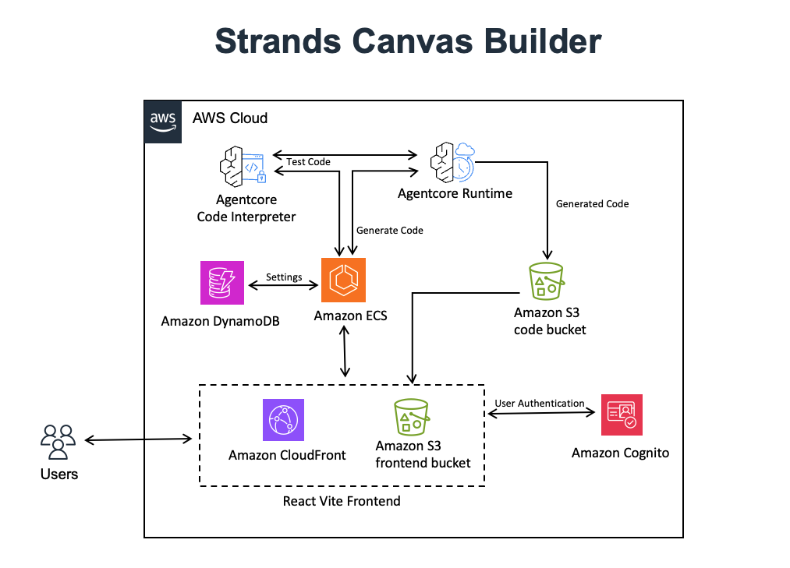

# Strands Visual Builder

A sample visual development platform for building, deploying, and managing Strands AI agents with drag-and-drop components, AI-powered code generation, and seamless AWS AgentCore integration.



## Overview

Strands Visual Builder is a development and learning platform that provides a complete visual development environment for experimenting with AI agents. Design complex agent workflows using an intuitive drag-and-drop canvas, leverage an expert AI agent for intelligent code generation, and deploy to AWS AgentCore for testing and evaluation. This sample application demonstrates advanced AI agent development patterns and serves as a learning tool for developers exploring the Strands SDK.

**Note: This is a sample application intended for development, testing, and learning purposes only. It is not recommended for production use as-is.**

## Key Features

### Visual Development Environment
- **Drag-and-Drop Canvas**: Intuitive React Flow-based interface for designing agent workflows
- **Node-Based Architecture**: Visual representation of agents, tools, and their connections
- **Real-Time Validation**: Instant feedback on configuration and connection validity
- **Responsive Design**: Cloudscape Design System for AWS-native user experience

### AI-Powered Code Generation
- **Expert Agent**: Specialized Strands agent deployed on AgentCore for intelligent code generation
- **Context-Aware Generation**: Understands visual designs and generates appropriate implementations
- **Multi-Pattern Support**: Supports swarms, graphs, sequential workflows, and agent-as-tools patterns
- **Security-First**: Built-in input validation and secure code generation practices

### AWS Deployment
- **AgentCore Integration**: One-click deployment to Amazon Bedrock AgentCore Runtime for testing
- **Live Testing**: Real-time chat interface with deployed agents
- **Streaming Responses**: WebSocket-based streaming for immediate feedback
- **Deployment Management**: Monitor and manage multiple agent deployments

### Advanced Tool Ecosystem
- **Strands Tools Library**: Comprehensive library of pre-built capabilities
- **Smart Discovery**: Automatic tool inspection and documentation
- **Custom Tool Support**: Visual integration of custom tool development
- **Tool Relationships**: Intelligent suggestions for complementary tools

### Project Management
- **Persistent Storage**: AWS Cognito authentication with DynamoDB backend
- **Version Control**: Track changes and iterations of agent designs
- **Export/Import**: Download generated code and share projects
- **Session Management**: Maintain conversation context across deployments

## Prerequisites

### Required Software
- **Node.js 18+** and npm for frontend development
- **Python 3.10+** with pip for backend services
- **AWS CLI** configured with appropriate credentials (`aws configure`)
- **Docker** for containerized deployments and AgentCore
- **AWS CDK** for infrastructure deployment (`npm install -g aws-cdk`)
- **jq** for JSON processing in deployment scripts

### AWS Requirements
- AWS account with appropriate permissions
- Bedrock model access enabled (Claude 3.5 Sonnet recommended)
- AgentCore service access in your region
- CDK bootstrap completed in target region

## Getting Started

### Quick Start (AWS Account Deployment)

Deploy the complete platform to your AWS account for development and testing:

```bash
# Full AWS deployment with admin user creation
./deploy.sh --email admin@yourcompany.com --profile your-aws-profile --region us-east-1
```

**What this deploys:**
- **AWS Infrastructure**: VPC, security groups, IAM roles, and networking
- **Storage Layer**: DynamoDB tables, S3 buckets, and ECR repositories  
- **Authentication**: Cognito User Pool with admin user creation
- **Backend Service**: FastAPI application on ECS with Application Load Balancer
- **Expert Agent**: Strands agent deployed to AgentCore Runtime
- **Frontend**: React application deployed to CloudFront
- **Configuration**: SSM parameters and environment setup

### Local Development Setup

For development and testing, set up the local environment:

```bash
# 1. Start local development servers (after AWS deployment)
./start.sh

# 2. Access the application
# Frontend: http://localhost:5173
# Backend API: http://localhost:8080  
```

### AgentCore Runtime Updates

Update only the AgentCore expert agent with latest code changes:

```bash
# Update AgentCore Runtime with latest agent code
./deploy.sh --agentcore-runtime --profile your-aws-profile
```

### Environment Configuration

The deployment automatically creates environment files:

```bash
# AWS deployment environment (auto-generated)
.env

# Local development overrides
.env.local  # Create this for local development customization
```

## Architecture

### Frontend (React Application)
- **React 19** with modern hooks and concurrent features
- **Cloudscape Design System** for AWS-native UI components and consistent UX
- **React Flow** for visual node-based agent design and workflow management
- **Zustand** for lightweight, performant state management
- **Vite** for fast development builds and hot module replacement
- **AWS Amplify** for authentication integration and API communication

### Backend (FastAPI Service)
- **FastAPI** with async/await for high-performance API endpoints
- **Strands SDK** integration for agent orchestration and tool management
- **AWS SDK (boto3)** for seamless cloud service integration
- **Pydantic** for robust data validation and serialization
- **SSM Parameter Store** for secure configuration management

### AgentCore Expert Agent
- **Strands Agent** deployed on Bedrock AgentCore Runtime
- **Custom Code Interpreter** with pre-installed Strands packages
- **S3 Code Storage** for dual code generation and session management
- **Streaming Support** for real-time code generation feedback

### AWS Infrastructure (CDK)
- **Amazon Bedrock AgentCore** for serverless agent runtime deployment
- **Amazon Cognito** for user authentication and authorization
- **Amazon DynamoDB** for project persistence and user data
- **Amazon S3** for frontend hosting and temporary code storage
- **Amazon CloudFront** for global content delivery and API proxy
- **Amazon ECS with Application Load Balancer** for containerized backend deployment
- **Amazon ECR** for Docker image storage and management
- **AWS Systems Manager** for parameter and configuration management

## Core Capabilities

### Visual Agent Designer
- **Interactive Canvas**: React Flow-powered drag-and-drop interface for agent workflow design
- **Node-Based Architecture**: Visual representation of agents, tools, and their interconnections
- **Real-Time Validation**: Instant feedback on configuration validity and connection logic
- **Multi-Agent Orchestration**: Support for complex systems with multiple collaborating agents
- **Responsive Layout**: Adaptive interface that works across different screen sizes

### AI-Powered Code Generation
- **Expert Agent System**: Specialized Strands agent deployed on AgentCore for intelligent code generation
- **Context-Aware Analysis**: Deep understanding of visual designs to generate appropriate implementations
- **Security-First Generation**: Built-in input validation and secure coding practices
- **Pattern Recognition**: Automatic detection and implementation of optimal agent patterns
- **Testing Integration**: Generated code includes comprehensive testing and validation

### Advanced Tool Ecosystem
- **Comprehensive Library**: Extensive collection of pre-built Strands tools for diverse functionality
- **Intelligent Discovery**: Automatic tool inspection, documentation, and capability analysis
- **Smart Recommendations**: AI-powered suggestions for complementary tools and optimal combinations
- **Custom Tool Integration**: Seamless support for custom tool development and integration
- **Live Documentation**: Real-time tool information with usage examples and best practices

### AWS Deployment Pipeline
- **AgentCore Integration**: Seamless deployment to Amazon Bedrock AgentCore Runtime for testing
- **Live Testing Environment**: Real-time chat interface for immediate agent validation
- **Streaming Architecture**: WebSocket-based streaming for responsive user experience
- **Deployment Monitoring**: Comprehensive monitoring and management of deployed agents
- **Scalable Infrastructure**: Auto-scaling deployment infrastructure with AWS services

### Project Management
- **Secure Authentication**: AWS Cognito integration for user management
- **Persistent Storage**: DynamoDB-backed project storage with version control
- **Collaboration Features**: Project sharing and team collaboration capabilities
- **Export/Import System**: Flexible project portability and code generation options
- **Session Management**: Stateful conversation management across deployments

## 📁 Project Structure

```
strands-visual-builder/
├── Frontend (React Application)
│   ├── src/
│   │   ├── components/              # UI Components
│   │   │   ├── Canvas.jsx          # Main visual design canvas
│   │   │   ├── AgentNode.jsx       # Visual agent representation
│   │   │   ├── ToolNode.jsx        # Visual tool representation
│   │   │   ├── CodeGenerationPanel.jsx     # AI code generation interface
│   │   │   ├── AgentCoreChatInterface.jsx  # Live agent testing
│   │   │   ├── ComponentPalette.jsx        # Tool library and templates
│   │   │   └── PropertyPanel.jsx           # Node configuration panel
│   │   ├── services/               # API Integration
│   │   │   ├── expertAgentService.js       # Code generation API
│   │   │   ├── authService.js             # AWS Cognito authentication
│   │   │   ├── s3CodeService.js           # S3 code storage
│   │   │   └── settingsService.js         # Configuration management
│   │   ├── store/                  # State Management
│   │   │   └── useBuilderStore.js  # Zustand global state
│   │   ├── contexts/               # React Contexts
│   │   │   └── SettingsContext.jsx # Settings and configuration
│   │   └── utils/                  # Utilities
│   │       ├── configExtraction.js # Visual config processing
│   │       └── pythonExecutor.js   # Local code execution
│   ├── package.json                # Frontend dependencies
│   └── vite.config.js             # Vite build configuration
│
├── Backend (FastAPI Service)
│   ├── backend/
│   │   ├── main.py                 # FastAPI application entry point
│   │   ├── routers/                # API Route Handlers
│   │   │   ├── code.py            # Code generation endpoints
│   │   │   ├── agentcore.py       # AgentCore integration
│   │   │   ├── auth.py            # Authentication endpoints
│   │   │   ├── projects.py        # Project management
│   │   │   └── tools.py           # Tool discovery and info
│   │   ├── services/               # Business Logic Services
│   │   │   ├── agent_service.py    # Expert agent orchestration
│   │   │   ├── agentcore_service.py # AgentCore deployment
│   │   │   ├── auth_service.py     # Cognito authentication
│   │   │   ├── db_service.py       # DynamoDB operations
│   │   │   └── config_service.py   # SSM parameter management
│   │   ├── models/                 # Pydantic Data Models
│   │   │   └── api_models.py       # Request/response models
│   │   ├── steering/               # AI Agent Context Files
│   │   │   ├── strands-sdk-core.md # Strands SDK guidance
│   │   │   ├── agentcore-*.md      # AgentCore integration guides
│   │   │   └── strands-*.md        # Strands patterns and tools
│   │   ├── tools/                  # Custom Tools
│   │   │   └── s3_code_storage_tool.py # S3 code storage functionality
│   │   ├── Dockerfile.backend      # Container configuration
│   │   └── requirements.txt        # Python dependencies
│
├── AgentCore Expert Agent
│   ├── expert_agent.py             # Main AgentCore deployment agent
│   ├── model_utils.py              # Model configuration utilities
│   └── agentcore-deployment/       # Deployment artifacts (generated)
│
├── AWS Infrastructure (CDK)
│   ├── cdk/
│   │   ├── lib/                    # CDK Stack Definitions
│   │   │   ├── 01-foundation-stack.ts      # VPC, IAM, ECR
│   │   │   ├── 02-storage-stack.ts         # S3, DynamoDB
│   │   │   ├── 03-auth-stack.ts            # Cognito User Pool
│   │   │   ├── 04-backend-stack.ts         # ECS, ALB
│   │   │   ├── 05-agentcore-stack.ts       # AgentCore Runtime
│   │   │   └── 06-frontend-stack.ts        # CloudFront, S3
│   │   ├── bin/                    # CDK App Entry Point
│   │   ├── package.json            # CDK dependencies
│   │   └── outputs.json           # Deployment outputs (generated)
│
├── Deployment & Configuration
│   ├── deploy.sh                   # Main deployment orchestration script
│   ├── start.sh                    # Local development startup
│   ├── .env                        # Environment configuration (generated)
│   └── .env.local                  # Local development overrides
│
└── Documentation
    ├── README.md                   # This file
    ├── strands-vb-arch.png        # Architecture diagram
    └── LICENSE                     # Project license
```

## Development

### Local Development

**Prerequisites**: AWS deployment must be completed first to provide required infrastructure.

```bash
# Start development environment (after deployment)
./start.sh

# Individual components
npm run dev          # Frontend only
npm run backend      # Backend only
npm run build        # Optimized build
```

### Workflow
1. Design agents visually on the canvas
2. Generate code using the AI expert agent
3. Test locally with the built-in Python executor
4. Deploy to AgentCore for testing and evaluation

## 🛠️ Configuration

### Backend Configuration (`.env`)

**Basic Configuration:**
```bash
AWS_REGION=us-west-2
BEDROCK_MODEL_ID=us.anthropic.claude-3-7-sonnet-20250219-v1:0
SERVICE_PORT=8080
```

**With Save/Load Features (after CDK deployment):**
```bash
AWS_REGION=us-west-2
COGNITO_USER_POOL_ID=us-west-2_xxxxxxxxx
COGNITO_USER_POOL_CLIENT_ID=xxxxxxxxxxxxxxxxxxxxxxxxxx
DYNAMODB_TABLE_NAME=strands-visual-builder-projects
BACKEND_ROLE_ARN=arn:aws:iam::123456789012:role/strands-visual-builder-backend-role
```

### AWS Setup
- Run `aws configure` for local development
- Enable Bedrock model access in AWS console
- For save/load features: Deploy CDK infrastructure (`cd cdk && ./deploy.sh`)
- For AWS deployment: use IAM roles (no access keys needed)

## Testing

The visual builder generates Strands code that you can:
1. Download as Python files
2. Test directly in the interface
3. Run locally with proper dependencies
4. Use as a starting point for your own development

## Documentation

- [Strands SDK Documentation](https://strandsagents.com)

## Troubleshooting

### Common Issues

1. **Backend won't start**: Check AWS credentials (`aws configure`)
2. **Frontend build errors**: Run `npm install`
3. **Port conflicts**: The script automatically kills existing processes
4. **Bedrock access denied**: Enable model access in AWS Bedrock console

### Logs

- Frontend: Check browser console
- Backend: Check terminal output or set `SERVICE_LOG_LEVEL=debug`

## Deployment Architecture & Workflow

### Deployment Phases

The deployment follows a carefully orchestrated multi-phase approach:

#### Phase 1: Infrastructure Foundation
```bash
# Deploys core AWS infrastructure
- VPC, Security Groups, IAM Roles
- ECR Repositories for container images  
- DynamoDB tables for project storage
- Cognito User Pool for authentication
- S3 buckets for frontend and temporary storage
```

#### Phase 2: Backend Services
```bash
# Builds and deploys backend services
- Docker image build with AMD64 architecture
- ECR image push and verification
- ECS service deployment with Application Load Balancer
- SSM parameter configuration for service discovery
```

#### Phase 3: AgentCore Expert Agent
```bash
# Deploys the AI expert agent
- AgentCore toolkit installation and configuration
- Custom Code Interpreter with pre-installed Strands packages
- Expert agent deployment with streaming support
- S3 code storage integration for dual generation
```

#### Phase 4: Frontend Distribution
```bash
# Builds and deploys the React frontend
- Vite optimized build with environment injection
- S3 static website hosting with optimized assets
- CloudFront distribution with API proxy configuration
- Cache invalidation for immediate updates
```

#### Phase 5: User Management
```bash
# Creates initial admin user
- Cognito user creation with email verification
- Temporary password generation and email delivery
- User pool configuration and permissions setup
```

### Deployment Commands

#### Full AWS Account Deployment
```bash
# Complete platform deployment with admin user
./deploy.sh --email admin@company.com --profile development --region us-west-2

# Deploy with specific configuration
./deploy.sh --email admin@company.com \
           --profile testing \
           --region us-east-1
```

#### Development & Updates
```bash
# Update only AgentCore Runtime (fastest for code changes)
./deploy.sh --agentcore-runtime --profile development

# Local development environment
./start.sh  # Requires prior AWS deployment for infrastructure
```

#### Deployment Verification
```bash
# The deployment script automatically verifies:
- Backend health check (GET /ping)
- Frontend accessibility (HTTP 200 response)
- AgentCore Runtime availability
- CloudFront distribution status
```

### Infrastructure Components

| Component              | Service               | Purpose                              |
| ---------------------- | --------------------- | ------------------------------------ |
| **Frontend**           | S3 + CloudFront       | React app hosting with global CDN    |
| **Backend**            | ECS + ALB             | FastAPI service with auto-scaling    |
| **Expert Agent**       | AgentCore Runtime     | AI code generation with streaming    |
| **Authentication**     | Cognito User Pool     | User management and JWT tokens       |
| **Storage**            | DynamoDB + S3         | Project persistence and file storage |
| **Container Registry** | ECR                   | Docker image storage and versioning  |
| **Configuration**      | SSM Parameter Store   | Secure configuration management      |
| **Networking**         | VPC + Security Groups | Secure network isolation             |

### Deployment Outputs

After successful deployment, you'll receive:

```bash
=== DEPLOYMENT SUMMARY ===
Backend URL: https://backend-alb-123456789.us-east-1.elb.amazonaws.com
Frontend URL: https://d1234567890123.cloudfront.net  
S3 Bucket: strands-frontend-bucket-xyz
AWS Region: us-east-1
AWS Profile: development
AgentCore Runtime: arn:aws:bedrock-agentcore:us-east-1:123456789012:agent-runtime/expert-agent-xyz

=== ADMIN USER CREDENTIALS ===
Email: admin@company.com
Temporary Password: Check email for temporary password
```

### Monitoring & Management

The deployment includes comprehensive monitoring:

- **CloudWatch Logs** for all services with structured logging
- **ECS Metrics** for backend performance monitoring  
- **CloudFront Metrics** for frontend performance and caching
- **AgentCore Observability** for agent execution tracing
- **DynamoDB Metrics** for storage performance monitoring

## Use Cases & Applications

### For Developers & Engineers
- **Rapid Prototyping**: Accelerate agent development from concept to working prototype
- **Learning Platform**: Visual approach to understanding Strands SDK patterns and capabilities
- **Code Generation**: AI-powered generation of tested code for development and learning
- **Best Practices**: Automatic adherence to Strands SDK conventions and security guidelines
- **Debugging & Testing**: Integrated testing environment with real-time feedback

### For Teams & Organizations
- **Visual Collaboration**: Intuitive designs facilitate cross-functional team discussions
- **Knowledge Transfer**: Visual representations capture and communicate architectural decisions
- **Standardization**: Consistent code patterns and practices across all team projects
- **Documentation**: Generated code serves as living, executable documentation
- **Onboarding**: Accelerated learning curve for new team members

### For Development & Testing
- **AWS Integration**: One-click deployment to AWS AgentCore for testing and evaluation
- **Security Best Practices**: Built-in security patterns and AWS integration examples
- **Monitoring & Observability**: Comprehensive logging, metrics, and performance monitoring
- **Cost Awareness**: Serverless architecture with consumption-based pricing for testing
- **Multi-Environment Support**: Seamless deployment across development and testing environments

### For Business Users & Product Managers
- **No-Code Agent Design**: Visual interface enables non-technical users to design agent workflows
- **Rapid Iteration**: Quick prototyping and testing of business logic and user experiences
- **Requirements Validation**: Interactive testing environment for validating business requirements
- **Stakeholder Communication**: Visual designs facilitate clear communication with technical teams

## Troubleshooting & Support

### Common Deployment Issues

#### Prerequisites & Environment
```bash
# Check AWS CLI configuration
aws sts get-caller-identity --profile your-profile

# Verify CDK bootstrap status  
aws ssm get-parameter --name "/cdk-bootstrap/hnb659fds/version" --region us-east-1

# Check Docker daemon
docker info

# Verify required tools
node --version  # Should be 18+
python3 --version  # Should be 3.10+
cdk --version
jq --version
```

#### Backend Service Issues
```bash
# Check backend health
curl https://your-backend-url/ping

# View ECS logs
aws logs tail /ecs/strands-backend --follow --profile your-profile

# Verify ECR image
aws ecr describe-images --repository-name strands-visual-builder-backend --profile your-profile

# Test local backend
cd backend && python main.py
```

#### Frontend Deployment Issues
```bash
# Check CloudFront distribution
aws cloudfront get-distribution --id YOUR_DISTRIBUTION_ID --profile your-profile

# Verify S3 bucket contents
aws s3 ls s3://your-frontend-bucket --profile your-profile

# Test local frontend
npm run dev
```

#### AgentCore Runtime Issues
```bash
# List AgentCore runtimes
aws bedrock-agentcore-control list-agent-runtimes --profile your-profile

# Check AgentCore toolkit
agentcore --version

# Verify Bedrock model access
aws bedrock list-foundation-models --region us-east-1 --profile your-profile

# Test AgentCore invocation
aws bedrock-agentcore invoke-agent-runtime \
  --agent-runtime-arn "your-arn" \
  --payload '{"prompt":"test"}' \
  --profile your-profile
```

### Authentication & Authorization Issues

#### Cognito User Pool Issues
```bash
# Check user pool configuration
aws cognito-idp describe-user-pool --user-pool-id YOUR_POOL_ID --profile your-profile

# List users in pool
aws cognito-idp list-users --user-pool-id YOUR_POOL_ID --profile your-profile

# Reset user password
aws cognito-idp admin-set-user-password \
  --user-pool-id YOUR_POOL_ID \
  --username user@example.com \
  --password NewPassword123! \
  --permanent \
  --profile your-profile
```

#### Permission Issues
```bash
# Check IAM role policies
aws iam get-role --role-name strands-agentcore-execution-role --profile your-profile

# Verify SSM parameter access
aws ssm get-parameters-by-path --path "/strands-visual-builder" --profile your-profile
```

### Performance & Monitoring

#### Backend Performance
```bash
# Monitor ECS metrics
aws cloudwatch get-metric-statistics \
  --namespace AWS/ECS \
  --metric-name CPUUtilization \
  --start-time 2024-01-01T00:00:00Z \
  --end-time 2024-01-01T23:59:59Z \
  --period 3600 \
  --statistics Average \
  --profile your-profile
```

#### Frontend Performance
```bash
# Check CloudFront cache hit ratio
aws cloudwatch get-metric-statistics \
  --namespace AWS/CloudFront \
  --metric-name CacheHitRate \
  --dimensions Name=DistributionId,Value=YOUR_DISTRIBUTION_ID \
  --start-time 2024-01-01T00:00:00Z \
  --end-time 2024-01-01T23:59:59Z \
  --period 3600 \
  --statistics Average \
  --profile your-profile
```

### Development Issues

#### Local Development Setup
```bash
# Install frontend dependencies
npm install

# Install backend dependencies  
cd backend && pip install -r requirements.txt

# Start development servers
./start.sh

# Check ports are available
lsof -i :5173  # Frontend
lsof -i :8080  # Backend
```

#### Code Generation Issues
- **Expert Agent Not Responding**: Check AgentCore Runtime status and logs
- **Invalid Generated Code**: Verify Strands SDK version compatibility
- **Timeout Errors**: Increase timeout settings in AgentCore configuration
- **Model Access Denied**: Enable Bedrock model access in AWS console

### Error Codes & Solutions

| Error Code                  | Description                  | Solution                                 |
| --------------------------- | ---------------------------- | ---------------------------------------- |
| `ValidationException`       | Invalid request parameters   | Check payload format and required fields |
| `ResourceNotFoundException` | AgentCore runtime not found  | Verify runtime ARN and deployment status |
| `AccessDeniedException`     | Insufficient permissions     | Check IAM roles and policies             |
| `ThrottlingException`       | Rate limit exceeded          | Implement exponential backoff            |
| `CORS Error`                | Cross-origin request blocked | Verify backend CORS configuration        |
| `401 Unauthorized`          | Authentication failed        | Check Cognito token validity             |

### Getting Help & Support

#### Documentation Resources
- **Strands SDK Documentation**: https://strandsagents.com

#### Log Locations
- **Backend Logs**: CloudWatch Logs → `/ecs/strands-backend`
- **Frontend Logs**: Browser Developer Console
- **AgentCore Logs**: CloudWatch Logs → `/aws/bedrock-agentcore`
- **CDK Deployment Logs**: Terminal output during deployment

#### Debug Mode
```bash
# Enable debug logging for backend
export SERVICE_LOG_LEVEL=debug
./start.sh

# Enable verbose CDK output
export CDK_DEBUG=true
./deploy.sh --profile your-profile
```

## Technology Stack

### Frontend Technologies
- **React 19** - Modern React with concurrent features and improved performance
- **Cloudscape Design System** - AWS-native UI components for consistent enterprise UX
- **React Flow** - Advanced node-based visual editor with drag-and-drop capabilities
- **Zustand** - Lightweight state management with minimal boilerplate
- **Vite** - Fast build tool with hot module replacement for rapid development
- **AWS Amplify** - Seamless AWS service integration and authentication

### Backend Technologies
- **FastAPI** - High-performance async Python web framework
- **Strands SDK** - Advanced AI agent framework with multi-agent capabilities
- **Pydantic** - Data validation and serialization with type safety
- **boto3** - Comprehensive AWS SDK for Python integration
- **uvicorn** - Lightning-fast ASGI server for production deployment

### AI & Agent Technologies
- **Amazon Bedrock** - Managed foundation model service for AI capabilities
- **AgentCore Runtime** - Serverless agent execution environment with enterprise features
- **Strands Agents** - Advanced multi-agent framework with streaming support
- **Custom Code Interpreter** - Secure sandboxed environment for code execution and testing

### AWS Infrastructure
- **Amazon Cognito** - User authentication and authorization with enterprise identity integration
- **Amazon DynamoDB** - NoSQL database for project storage and user data
- **Amazon S3** - Object storage for frontend assets and temporary code storage
- **Amazon CloudFront** - Global CDN for fast content delivery and API proxy
- **Amazon ECS with Application Load Balancer** - Containerized application deployment with auto-scaling
- **Amazon ECR** - Container registry for Docker image storage and management
- **AWS Systems Manager** - Parameter store for secure configuration management
- **AWS CDK** - Infrastructure as code with TypeScript for reproducible deployments

## Security

See [CONTRIBUTING](CONTRIBUTING.md) for more information.

## Coming Soon / In Development

The following features are currently in development or planned for future releases:

### AgentCore Gateway Integration
- **Tool Discovery**: Semantic search across hundreds of available tools through AgentCore Gateway
- **API Integration**: Convert existing APIs and Lambda functions into MCP-compatible tools

### Enhanced MCP Support
- **Visual MCP Configuration**: Drag-and-drop MCP server components in the visual designer
- **Server Validation**: Real-time validation and testing of MCP server connections
- **Tool Expansion**: Access to expanded tool ecosystem through MCP protocol
- **Custom MCP Servers**: Support for deploying custom MCP servers

### Natural Language Agent Creation
- **Conversational Agent Design**: Describe your agent requirements in natural language
- **Intelligent Architecture Selection**: AI automatically chooses optimal agent patterns and tools
- **Requirement Analysis**: Natural language processing to understand complex agent specifications
- **Iterative Refinement**: Chat-based refinement of agent behavior and capabilities


## License

This library is licensed under the MIT-0 License. See the LICENSE file.

**Disclaimer: This is a sample application for development, testing, and educational purposes only. It is not intended for production use as-is.**

---