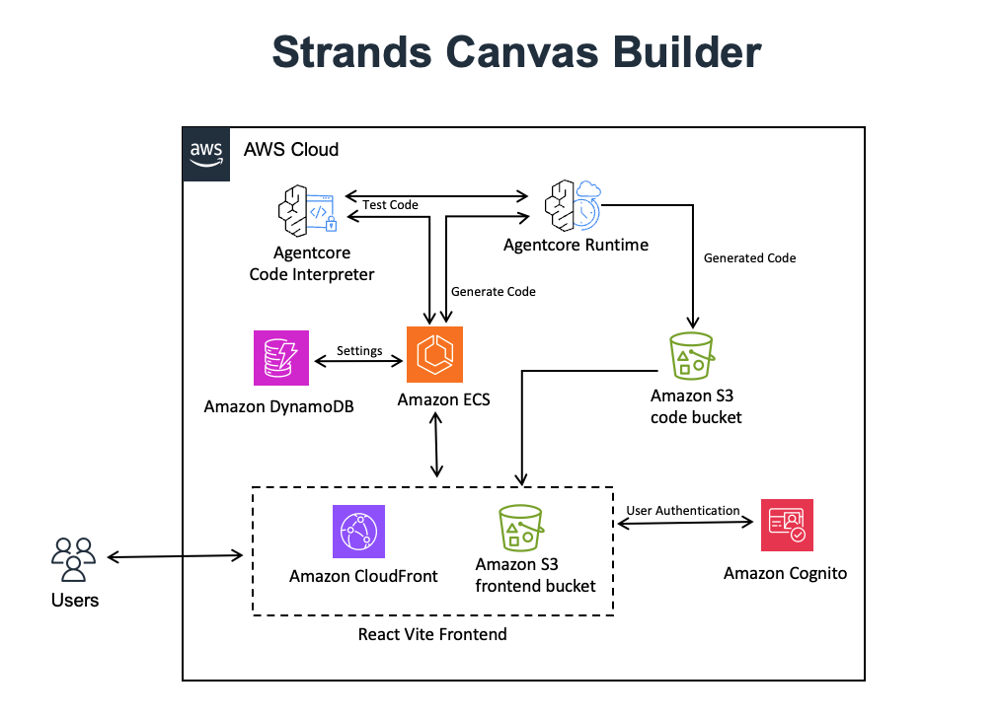

# Sample: Strands Visual Builder

A sample visual development platform for building, deploying, and managing Strands AI agents with drag-and-drop components, AI-powered code generation, and AWS AgentCore integration.



## Overview

Strands Visual Builder provides a visual development environment for experimenting with AI agents. Design agent workflows using a drag-and-drop canvas, generate code with a specialized AI agent, and deploy to AWS AgentCore for testing. This sample application demonstrates advanced AI agent development patterns and serves as a learning tool for developers exploring the Strands SDK.

**Note: This is a sample application intended for development, testing, and learning purposes only. It is not recommended for production use as-is.**

## Key Features

- **Visual Canvas**: React Flow-based drag-and-drop interface for designing agent workflows with real-time validation
- **AI Code Generation**: Specialized Strands agent on AgentCore generates context-aware implementations supporting swarms, graphs, sequential workflows, and agent-as-tools patterns
- **AgentCore Deployment**: One-click deployment to Amazon Bedrock AgentCore Runtime with live testing via streaming chat interface
- **AgentCore Gateway**: Create and manage AgentCore Gateways with Lambda function targets for custom tool integration
- **MCP Server Integration**: Add Model Context Protocol servers to agent designs for extended tool capabilities
- **Tool Ecosystem**: Pre-built Strands tools library with smart discovery, documentation, and custom tool support
- **Project Management**: Cognito authentication, DynamoDB-backed persistence, version tracking, and export/import

## Prerequisites

### Required Software
- **Node.js 18+** and npm
- **Python 3.10+** with pip
- **AWS CLI** configured with credentials (`aws configure`)
- **Docker** for containerized deployments
- **AWS CDK** (`npm install -g aws-cdk`)
- **jq** for JSON processing

### AWS Requirements
- AWS account with appropriate permissions
- Bedrock model access enabled for your preferred Claude model
- AgentCore service access in your region
- CDK bootstrap completed in target region
- Gateway features require Lambda functions with `strands-` prefix

## Getting Started

### Quick Start (AWS Deployment)

```bash
./deploy.sh --email admin@yourcompany.com --profile your-aws-profile --region us-east-1
```

This deploys: VPC and networking, DynamoDB/S3/ECR storage, Cognito authentication, FastAPI backend on ECS with ALB, Strands expert agent on AgentCore, React frontend on CloudFront, and SSM configuration.

### Local Development

```bash
# Start local servers (requires prior AWS deployment)
./start.sh

# Frontend: http://localhost:7001
# Backend:  http://localhost:8080
```

### AgentCore Runtime Updates

```bash
./deploy.sh --agentcore-runtime --profile your-aws-profile
```

### Environment Configuration

Deployment automatically generates `.env`. Create `.env.local` for local overrides.

## Architecture

### Frontend (React)
- **React 19** with concurrent features
- **Cloudscape Design System** for AWS-native UX
- **React Flow** for node-based visual design
- **Zustand** for state management
- **Vite** for builds and HMR
- **AWS Amplify** for auth and API integration

### Backend (FastAPI)
- **FastAPI** with async endpoints
- **Strands SDK** for agent orchestration
- **boto3** for AWS service integration
- **Pydantic** for data validation
- **SSM Parameter Store** for configuration

### AgentCore Expert Agent
- **Strands Agent** on Bedrock AgentCore Runtime
- **Custom Code Interpreter** with pre-installed Strands packages
- **S3 Code Storage** for code generation and session management
- **Streaming Support** for real-time feedback

### AWS Infrastructure (CDK)
- **Amazon Bedrock AgentCore** — serverless agent runtime
- **Amazon Bedrock AgentCore Gateway** — Lambda-based tool integration via MCP
- **Amazon Cognito** — user authentication
- **Amazon DynamoDB** — project persistence
- **Amazon S3** — frontend hosting and temp storage
- **Amazon CloudFront** — CDN and API proxy
- **Amazon ECS + ALB** — containerized backend
- **Amazon ECR** — Docker image registry
- **AWS Systems Manager** — parameter management

### MCP Integration
- **Model Context Protocol** servers for extended tool capabilities
- **Gateway MCP** for connecting agents to Lambda-based tools
- **Custom MCP Servers** for third-party service integration

## Project Structure

```
strands-visual-builder/
├── Frontend (React Application)
│   ├── src/
│   │   ├── components/              # UI Components
│   │   │   ├── Canvas.jsx          # Main visual design canvas
│   │   │   ├── AgentNode.jsx       # Visual agent representation
│   │   │   ├── ToolNode.jsx        # Visual tool representation
│   │   │   ├── CodeGenerationPanel.jsx     # AI code generation interface
│   │   │   ├── AgentCoreChatInterface.jsx  # Live agent testing
│   │   │   ├── ComponentPalette.jsx        # Tool library and templates
│   │   │   └── PropertyPanel.jsx           # Node configuration panel
│   │   ├── services/               # API Integration
│   │   │   ├── expertAgentService.js       # Code generation API
│   │   │   ├── authService.js             # AWS Cognito authentication
│   │   │   ├── s3CodeService.js           # S3 code storage
│   │   │   └── settingsService.js         # Configuration management
│   │   ├── store/                  # State Management
│   │   │   └── useBuilderStore.js  # Zustand global state
│   │   ├── contexts/               # React Contexts
│   │   │   └── SettingsContext.jsx # Settings and configuration
│   │   └── utils/                  # Utilities
│   │       ├── configExtraction.js # Visual config processing
│   │       └── pythonExecutor.js   # Local code execution
│   ├── package.json
│   └── vite.config.js
│
├── Backend (FastAPI Service)
│   ├── backend/
│   │   ├── main.py                 # FastAPI entry point
│   │   ├── routers/                # API Route Handlers
│   │   │   ├── code.py            # Code generation endpoints
│   │   │   ├── agentcore.py       # AgentCore integration
│   │   │   ├── auth.py            # Authentication endpoints
│   │   │   ├── projects.py        # Project management
│   │   │   └── tools.py           # Tool discovery and info
│   │   ├── services/               # Business Logic
│   │   │   ├── agent_service.py    # Expert agent orchestration
│   │   │   ├── agentcore_service.py # AgentCore deployment
│   │   │   ├── auth_service.py     # Cognito authentication
│   │   │   ├── db_service.py       # DynamoDB operations
│   │   │   └── config_service.py   # SSM parameter management
│   │   ├── models/
│   │   │   └── api_models.py       # Pydantic request/response models
│   │   ├── steering/               # AI Agent Context Files
│   │   ├── tools/
│   │   │   └── s3_code_storage_tool.py
│   │   ├── Dockerfile.backend
│   │   └── requirements.txt
│
├── AgentCore Expert Agent
│   ├── expert_agent.py             # Main AgentCore deployment agent
│   └── model_utils.py              # Model configuration utilities
│
├── AWS Infrastructure (CDK)
│   ├── cdk/
│   │   ├── lib/                    # CDK Stack Definitions
│   │   │   ├── 01-foundation-stack.ts      # VPC, IAM, ECR
│   │   │   ├── 02-storage-stack.ts         # S3, DynamoDB
│   │   │   ├── 03-auth-stack.ts            # Cognito User Pool
│   │   │   ├── 04-backend-stack.ts         # ECS, ALB
│   │   │   ├── 05-agentcore-stack.ts       # AgentCore Runtime
│   │   │   └── 06-frontend-stack.ts        # CloudFront, S3
│   │   ├── bin/
│   │   ├── package.json
│   │   └── outputs.json           # Deployment outputs (generated)
│
├── Deployment & Configuration
│   ├── deploy.sh                   # Main deployment script
│   ├── start.sh                    # Local development startup
│   ├── .env                        # Environment config (generated)
│   └── .env.local                  # Local overrides
│
└── Documentation
    ├── README.md
    ├── strands-vb-arch.png
    └── LICENSE
```

## Development

### Local Development

Prerequisites: AWS deployment must be completed first.

```bash
./start.sh

# Or run individually:
npm run dev          # Frontend only
npm run backend      # Backend only
npm run build        # Production build
```

### Workflow
1. Design agents visually on the canvas
2. Generate code using the AI expert agent
3. Test locally with the built-in Python executor
4. Deploy to AgentCore for testing and evaluation

## Configuration

### Backend Configuration (`.env`)

```bash
# Basic
AWS_REGION=us-west-2
BEDROCK_MODEL_ID=us.anthropic.claude-3-7-sonnet-20250219-v1:0
SERVICE_PORT=8080

# With CDK deployment (auto-populated)
COGNITO_USER_POOL_ID=us-west-2_xxxxxxxxx
COGNITO_USER_POOL_CLIENT_ID=xxxxxxxxxxxxxxxxxxxxxxxxxx
DYNAMODB_TABLE_NAME=strands-visual-builder-projects
BACKEND_ROLE_ARN=arn:aws:iam::123456789012:role/strands-visual-builder-backend-role
```

### AWS Setup
- Run `aws configure` for local development
- Enable Bedrock model access in AWS console
- For save/load features: Deploy CDK infrastructure (`./deploy.sh --profile your-profile`)
- For AWS deployment: use IAM roles (no access keys needed)

## Deployment Architecture

### Deployment Phases

#### Phase 1: Infrastructure Foundation
VPC, security groups, IAM roles, ECR repositories, DynamoDB tables, Cognito User Pool, S3 buckets.

#### Phase 2: Backend Services
Docker image build (AMD64), ECR push, ECS deployment with ALB, SSM parameter configuration.

#### Phase 3: AgentCore Expert Agent
AgentCore toolkit setup, custom Code Interpreter with Strands packages, expert agent deployment with streaming and S3 integration.

#### Phase 4: Frontend Distribution
Vite optimized build, S3 static hosting, CloudFront distribution with API proxy, cache invalidation.

#### Phase 5: User Management
Cognito admin user creation with email verification and temporary password delivery.

### Deployment Commands

```bash
# Full deployment
./deploy.sh --email admin@company.com --profile development --region us-west-2

# Update AgentCore only
./deploy.sh --agentcore-runtime --profile development

# Local development
./start.sh
```

### Infrastructure Components

| Component              | Service               | Purpose                              |
| ---------------------- | --------------------- | ------------------------------------ |
| **Frontend**           | S3 + CloudFront       | React app hosting with global CDN    |
| **Backend**            | ECS + ALB             | FastAPI service with auto-scaling    |
| **Expert Agent**       | AgentCore Runtime     | AI code generation with streaming    |
| **Authentication**     | Cognito User Pool     | User management and JWT tokens       |
| **Storage**            | DynamoDB + S3         | Project persistence and file storage |
| **Container Registry** | ECR                   | Docker image storage                 |
| **Configuration**      | SSM Parameter Store   | Secure configuration management      |
| **Networking**         | VPC + Security Groups | Network isolation                    |

### Deployment Outputs

```bash
=== DEPLOYMENT SUMMARY ===
Backend URL: https://backend-alb-123456789.us-east-1.elb.amazonaws.com
Frontend URL: https://d1234567890123.cloudfront.net
AWS Region: us-east-1
AgentCore Runtime: arn:aws:bedrock-agentcore:us-east-1:123456789012:agent-runtime/expert-agent-xyz

=== ADMIN USER CREDENTIALS ===
Email: admin@company.com
Temporary Password: Check email for temporary password
```

### Gateway Integration

The Visual Builder supports AgentCore Gateway for connecting agents to Lambda-based tools:

1. Create a gateway from the **AgentCore** dropdown menu → **Gateway Management**
2. Create Lambda functions with the `strands-` prefix in your AWS account
3. Add Lambda targets to your gateway with tool schemas defining the tools
4. Grant the gateway role permission to invoke your Lambda (see [Gateway Lambda Permissions](#gateway-lambda-permissions))
5. Drag the gateway component onto your agent design canvas
6. After deploying the agent, grant the runtime role gateway access (see [Deployed Agent Runtime Permissions](#deployed-agent-runtime-permissions))

## Post-Deployment Configuration

### Gateway Lambda Permissions

After creating a gateway and adding a Lambda target, you must grant the gateway's IAM role permission to invoke the Lambda function:

```bash
# 1. Find the gateway role name (format: strands-vb-gw-{gateway-name}-role)
GATEWAY_ROLE="strands-vb-gw-{your-gateway-name}-role"

# 2. Add Lambda invoke permission to the gateway role
aws lambda add-permission \
  --function-name {your-lambda-function-name} \
  --statement-id gateway-invoke \
  --action lambda:InvokeFunction \
  --principal bedrock-agentcore.amazonaws.com \
  --source-arn "arn:aws:iam::{account-id}:role/${GATEWAY_ROLE}" \
  --profile your-profile
```

**Note**: Lambda functions used with gateways must have the `strands-` prefix in their name (e.g., `strands-inventory-tools`). This is enforced by the gateway role's permissions boundary.

### Deployed Agent Runtime Permissions

After deploying an agent to AgentCore, you may need to add IAM permissions to the agent's runtime role for the tools it uses:

#### Knowledge Base Access

If your agent uses a Bedrock Knowledge Base (Retrieve tool):

```bash
# 1. Find the deployed agent's runtime role
RUNTIME_ID=$(aws bedrock-agentcore-control list-agent-runtimes --region us-west-2 \
  --query "agentRuntimeSummaries[?contains(agentRuntimeName, 'your_agent_name')].agentRuntimeId" \
  --output text --profile your-profile)

ROLE_ARN=$(aws bedrock-agentcore-control get-agent-runtime \
  --agent-runtime-id $RUNTIME_ID --region us-west-2 \
  --query "agentRuntime.roleArn" --output text --profile your-profile)

ROLE_NAME=$(echo $ROLE_ARN | awk -F'/' '{print $NF}')

# 2. Add Knowledge Base permissions
aws iam put-role-policy --role-name $ROLE_NAME \
  --policy-name KnowledgeBaseAccess \
  --policy-document '{
    "Version": "2012-10-17",
    "Statement": [
      {
        "Effect": "Allow",
        "Action": ["bedrock:Retrieve", "bedrock:RetrieveAndGenerate"],
        "Resource": "arn:aws:bedrock:{region}:{account-id}:knowledge-base/{kb-id}"
      },
      {
        "Effect": "Allow",
        "Action": ["aoss:APIAccessAll"],
        "Resource": "arn:aws:aoss:{region}:{account-id}:collection/{collection-id}"
      }
    ]
  }' --profile your-profile
```

#### Gateway Access

If your agent uses an AgentCore Gateway:

```bash
# Add Gateway permissions to the runtime role
aws iam put-role-policy --role-name $ROLE_NAME \
  --policy-name GatewayAccess \
  --policy-document '{
    "Version": "2012-10-17",
    "Statement": [
      {
        "Effect": "Allow",
        "Action": ["bedrock-agentcore:*"],
        "Resource": "arn:aws:bedrock-agentcore:{region}:{account-id}:gateway/*"
      }
    ]
  }' --profile your-profile
```

#### Third-Party API Keys

If your agent uses tools that require API keys (e.g., Tavily for web search), pass them as environment variables during deployment in the AgentCore Deployment panel.

### MCP Server Deployments (OAuth)

When you deploy an agent as an **MCP server** (instead of a regular agent), external MCP clients connect to it via Cognito OAuth 2.0. The app automatically creates a Cognito OAuth client and returns the integration details (authorization URL, token URL, client ID, scopes) after deployment.

To connect an external MCP client:

1. After MCP deployment, the app displays the OAuth configuration details
2. Update the Cognito OAuth callback URL to match your MCP client:
   ```bash
   # The default callback URL is configured for Amazon QuickSight
   # To use a different MCP client, update the callback URL in:
   # cdk/lib/03-auth-stack.ts → mcpOAuthClient → oAuth → callbackUrls
   # Then redeploy: cdk deploy StrandsAuthStack --profile your-profile
   ```
3. Retrieve the client secret from the AWS Console (Cognito > App clients) — it is not exposed in the API response for security
4. Configure your MCP client with the provided OAuth URLs, client ID, and secret

**Note**: Regular agent deployments (non-MCP) do not require OAuth — they are invoked via IAM auth through the Visual Builder's backend.

## Troubleshooting

### Prerequisites Check
```bash
aws sts get-caller-identity --profile your-profile
node --version    # 18+
python3 --version # 3.10+
cdk --version
docker info
```

### Common Issues

| Issue | Solution |
| --- | --- |
| Backend won't start | Check AWS credentials (`aws configure`) |
| Frontend build errors | Run `npm install` |
| Port conflicts | `start.sh` automatically kills existing processes |
| Bedrock access denied | Enable model access in AWS Bedrock console |
| Expert agent not responding | Check AgentCore Runtime status and logs |
| CORS errors | Verify backend CORS configuration |
| 401 Unauthorized | Check Cognito token validity |

### Logs

- **Backend**: CloudWatch `/ecs/strands-backend` or terminal output
- **Frontend**: Browser developer console
- **AgentCore**: CloudWatch `/aws/bedrock-agentcore`

```bash
# Enable debug logging
export SERVICE_LOG_LEVEL=debug
./start.sh
```

### Useful Commands
```bash
# Backend health check
curl https://your-backend-url/ping

# View ECS logs
aws logs tail /ecs/strands-backend --follow --profile your-profile

# List AgentCore runtimes
aws bedrock-agentcore-control list-agent-runtimes --profile your-profile

# Reset Cognito user password
aws cognito-idp admin-set-user-password \
  --user-pool-id YOUR_POOL_ID \
  --username user@example.com \
  --password NewPassword123! \
  --permanent \
  --profile your-profile
```

## Coming Soon

- **Enhanced MCP Support**: Visual MCP configuration, server validation, and custom MCP servers
- **Natural Language Agent Creation**: Describe agent requirements conversationally with AI-driven architecture selection

## Important Notices

### Cost and Third-Party Services

This sample application interacts with Amazon Bedrock, which has pricing based on model usage:

- **Amazon Bedrock model invocations** incur charges based on input/output tokens. See [Amazon Bedrock Pricing](https://aws.amazon.com/bedrock/pricing/).
- **Amazon Bedrock AgentCore Runtime** has its own pricing for deployed agents. See [AgentCore Pricing](https://aws.amazon.com/bedrock/agentcore/pricing/).
- **Additional AWS services** provisioned by the CDK stack (ECS, DynamoDB, S3, CloudFront, Cognito, ECR) may incur charges. See [AWS Pricing](https://aws.amazon.com/pricing/).

Review the pricing of these services and confirm your use case is within budget before deploying.

## Security

See [SECURITY.md](SECURITY.md) for vulnerability reporting information.

See [CONTRIBUTING](CONTRIBUTING.md) for contribution guidelines.

## License

This library is licensed under the MIT-0 License. See the [LICENSE](LICENSE) file.

**Disclaimer: This is a sample application for development, testing, and educational purposes only. It is not intended for production use as-is.**

---
